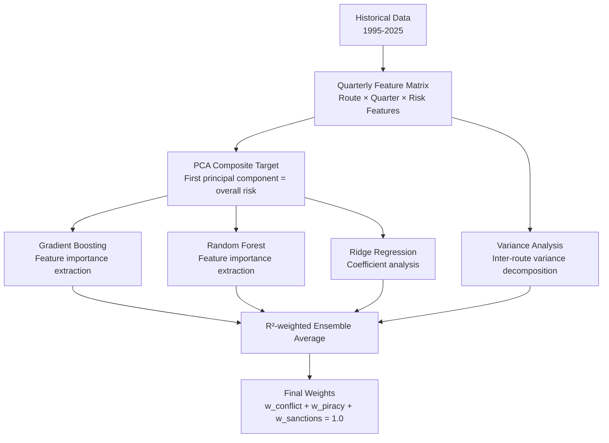

<p align="center">
  
  
  
  
  
</p>

<h1 align="center">🛡️ Predictive Supply Chain Resilience</h1>

<p align="center">
  <strong>Geopolitical Risk Value (GRV) Calculator for Global Maritime Trade Routes</strong><br/>
  <em>ML-powered risk intelligence for 11 shipping corridors × 12 commodity categories</em>
</p>

<p align="center">
  <a href="#-features">Features</a> •
  <a href="#-architecture">Architecture</a> •
  <a href="#-quick-start">Quick Start</a> •
  <a href="#-methodology">Methodology</a> •
  <a href="#-commodities">Commodities</a> •
  <a href="#-routes">Routes</a> •
  <a href="#-ml-models">ML Models</a> •
  <a href="#-project-structure">Project Structure</a>
</p>

---

## 📌 Overview

**Predictive Supply Chain Resilience** is a comprehensive analytics platform that computes **Geopolitical Risk Values (GRV)** for 11 major global maritime trade routes, tailored to 12 commodity categories spanning electrical equipment and petroleum products.

The application combines **30 years of geopolitical data (1995–2025)** with an **ensemble machine learning pipeline** to dynamically predict the optimal weighting of three risk factors — **conflict**, **piracy**, and **sanctions** — and then scores each route on a **1–10 scale** specific to the selected commodity's real-world shipping geography.

### Why This Matters

Global supply chains face $1.6 trillion in annual disruption losses. A single chokepoint closure (e.g., the 2021 Suez blockage, 2024 Houthi Red Sea attacks) can cascade across industries. This tool provides:

- **Route-specific risk scoring** — not generic country-level indices
- **Commodity-aware intelligence** — crude oil routes ≠ semiconductor routes
- **Data-driven weight prediction** — ML replaces subjective expert opinion
- **Real-time decision support** — interactive comparison and scenario analysis

---

## ✨ Features

### 🎯 Interactive Dashboard
- **Hero Metrics** — Average GRV, safest route, and highest-risk route at a glance
- **Global Risk Map** — Plotly geo-projection with color-coded routes (🟢 safest → 🔴 riskiest → ⚪ middle)
- **GRV Route Summary Table** — Sortable table with gradient heatmap coloring
- **Route Ranking Cards** — Styled cards with risk badges, progress bars, and chokepoint tags
- **Comparative Risk Breakdown** — Stacked horizontal bar chart decomposing conflict/piracy/sanctions

### 📊 Route Analysis
- **Single Commodity Analysis** — Detailed per-route breakdown with scores, event counts, and recommendations
- **Compare Commodities** — Side-by-side radar charts and GRV delta analysis for any two commodities
- **Route-Commodity Fit** — Only shows routes where the selected commodity is actually transported

### 🤖 ML Model Insights
- **4-Model Ensemble** — Gradient Boosting, Random Forest, Ridge Regression, Variance Analysis
- **Stock Market Validation** — Cross-referenced with Indian BSE/NSE market suppression data
- **Model Performance** — R² scores, feature importances, PCA explained variance

### 📈 Data Explorer
- **Conflict Data Explorer** — Filter and visualize 30 years of ACLED-style conflict events
- **Piracy Data Explorer** — Maritime piracy incidents by region, type, and severity
- **Sanctions Data Explorer** — Active sanctions programs affecting maritime trade

### 📐 Methodology
- **GRV Formula** — Transparent documentation of the weighted risk scoring formula
- **Sensitivity Matrix** — Visual matrix showing which routes matter for which commodities (`—` = not shipped)
- **Weight Prediction Pipeline** — End-to-end explanation of the ML approach

---

## 🏗️ Architecture

```
┌───────────────────────────────────────────────────────────────┐
│                     Streamlit Frontend (app.py)               │
│   Dashboard │ Route Analysis │ ML Insights │ Data Explorer    │
├───────────────────────────────────────────────────────────────┤
│                    Styles Layer (styles.py)                    │
│   CSS Theme │ Metric Cards │ Route Cards │ Weight Bars        │
├───────────────────────────────────────────────────────────────┤
│                  Business Logic Layer                          │
│  ┌─────────────────┐  ┌──────────────────┐  ┌──────────────┐ │
│  │ data_processor.py│  │  route_engine.py  │  │  ml_model.py │ │
│  │                  │  │                   │  │              │ │
│  │ • Load CSVs      │  │ • 11 Routes       │  │ • Gradient   │ │
│  │ • Aggregate per  │  │ • 12 Commodities  │  │   Boosting   │ │
│  │   route/quarter  │  │ • Sensitivity     │  │ • Random     │ │
│  │ • Compute scores │  │   multipliers     │  │   Forest     │ │
│  │ • Compute GRV    │  │ • Applicable      │  │ • Ridge      │ │
│  │ • Build features │  │   route filtering │  │ • Variance   │ │
│  └─────────────────┘  └──────────────────┘  │ • Ensemble   │ │
│                                              └──────────────┘ │
├───────────────────────────────────────────────────────────────┤
│                         Data Layer                             │
│   sheet_1_global_conflict_1995_2025.csv  (15.4 MB, ~150K rows)│
│   sheet_2_global_piracy_1995_2025.csv    (401 KB, ~8K rows)   │
│   sheet_3_global_sanctions_1995_2025.csv (8.4 KB, ~100 rows)  │
└───────────────────────────────────────────────────────────────┘
```

---

## 🚀 Quick Start

### Prerequisites

- Python 3.10 or higher
- pip package manager

### Installation

```bash
# 1. Clone or navigate to the project
cd "LSCM Project/v2"

# 2. Install dependencies
pip install -r requirements.txt

# 3. Launch the application
streamlit run app.py --server.headless true
```

The app will open at **http://localhost:8501**

### Requirements

| Package | Version | Purpose |
|---------|---------|---------|
| `streamlit` | ≥ 1.30.0 | Web framework & UI |
| `pandas` | ≥ 2.0.0 | Data manipulation |
| `numpy` | ≥ 1.24.0 | Numerical computing |
| `plotly` | ≥ 5.18.0 | Interactive charts & maps |
| `scikit-learn` | ≥ 1.3.0 | ML model training |
| `matplotlib` | ≥ 3.8.0 | DataFrame gradient styling |
| `folium` | ≥ 0.15.0 | Map rendering |

---

## 📐 Methodology

### GRV Formula

The Geopolitical Risk Value for a given route *r* and commodity *c* is computed as:

```
GRV(r, c) = [ w_conflict × S_conflict(r) + w_piracy × S_piracy(r) + w_sanctions × S_sanctions(r) ]
              × [ 0.3 + 0.7 × sensitivity(c, r) ]
```

Where:
- **w** = ML-predicted weights (sum to 1.0)
- **S(r)** = normalized sub-scores per route (0–1 scale, aggregated from historical event data)
- **sensitivity(c, r)** = commodity-specific route multiplier (0.2–3.0)

The raw score is then **min-max scaled to 1–10** across routes.

### Risk Level Thresholds

| GRV Range | Risk Level | Color |
|-----------|------------|-------|
| 1.0 – 3.0 | 🟢 Low | Green |
| 3.0 – 5.0 | 🟡 Moderate | Yellow |
| 5.0 – 7.5 | 🟠 High | Orange |
| 7.5 – 10.0 | 🔴 Critical | Red |

### Route Filtering

Each commodity defines an **`applicable_routes`** whitelist. Only routes where the commodity is actually transported appear in the analysis. For example:
- **EV Batteries** → 6 routes (Malacca, Transpacific, Suez, Red Sea, Transatlantic, India Coastal)
- **Crude Oil** → 7 routes (Hormuz, Suez, Cape, Red Sea, Malacca, India Coastal, Chabahar)
- **Semiconductors** → 6 routes (Transpacific, Malacca, Transatlantic, USA→India, EU→India, Red Sea)

This ensures route rankings are **geographically accurate** to real-world supply chains.

---

## 📦 Commodities

### ⚡ Electrical Equipment (7)

| # | Commodity | Icon | Key Origins | Critical Routes |
|---|-----------|------|-------------|-----------------|
| 1 | **EV Batteries** | 🔋 | China (CATL, BYD), Korea (LG, Samsung SDI), Japan (Panasonic) | Malacca, Transpacific |
| 2 | **Semiconductors** | 💽 | Taiwan (TSMC), Korea (Samsung), USA (Intel) | Transpacific, Malacca |
| 3 | **Solar Panels & PV** | ☀️ | China (LONGi, JA Solar, Trina) | Malacca (80%+ of India's imports) |
| 4 | **Power Transformers** | ⚡ | Germany (Siemens), Switzerland (ABB), France (Schneider) | Suez, Cape, Red Sea |
| 5 | **Electric Motors** | ⚙️ | China (Nidec), Japan (Yaskawa), Germany (Siemens) | Malacca, Suez, Chabahar |
| 6 | **Cables & Wiring** | 🔌 | China, India (Polycab), Italy (Prysmian) | Cape (copper ore), India Coastal |
| 7 | **LED & Lighting** | 💡 | China (Cree, MLS), Taiwan (Epistar) | Malacca, Transpacific |

### 🛢️ Petroleum Products (5)

| # | Commodity | Icon | Key Origins | Critical Routes |
|---|-----------|------|-------------|-----------------|
| 8 | **Crude Oil** | 🛢️ | Saudi Arabia, Iraq, UAE, Nigeria | Hormuz (dominant), Cape, Red Sea |
| 9 | **Sweet Crude Oil** | 🏗️ | Nigeria (Bonny Light), Norway (Brent), USA (WTI) | Cape, Suez, Red Sea |
| 10 | **LPG** | 🔥 | Saudi Arabia, Qatar, UAE, USA | Hormuz, India Coastal, Red Sea |
| 11 | **Petrol (Gasoline)** | ⛽ | India (Reliance), Saudi Arabia, Singapore | Hormuz, Malacca, India Coastal |
| 12 | **Diesel (HSD)** | 🚛 | India (Reliance), Saudi Arabia, Singapore | Hormuz, Malacca, India Coastal |

---

## 🗺️ Routes

The system covers **11 major maritime corridors** with precise waypoint geometries:

| # | Route | Chokepoints | Distance (nm) |
|---|-------|-------------|----------------|
| 1 | 🏛️ Europe → India (Suez) | Suez Canal, Bab-el-Mandeb, Strait of Hormuz | 6,200 |
| 2 | 🌊 Europe → India (Cape) | Cape of Good Hope, Mozambique Channel | 10,800 |
| 3 | 🇺🇸 USA West Coast ↔ East Asia | Panama Canal (optional), Pacific crossing | 5,500 |
| 4 | 🗽 USA East ↔ Europe | English Channel, North Atlantic | 3,500 |
| 5 | 🚢 USA East → India (Suez) | Gibraltar, Suez Canal | 8,500 |
| 6 | ⛵ East Asia → India (Malacca) | Strait of Malacca, Andaman Sea | 4,600 |
| 7 | 🏗️ Persian Gulf → India (Hormuz) | Strait of Hormuz, Arabian Sea | 1,500 |
| 8 | 🕌 Iran → India (Chabahar) | Chabahar Port, Arabian Sea | 800 |
| 9 | ⚓ Red Sea Corridor | Bab-el-Mandeb, Suez Canal | 1,200 |
| 10 | 🇱🇰 India ↔ Sri Lanka | Palk Strait, Gulf of Mannar | 400 |
| 11 | 🇮🇳 India Coastal | Western & Eastern Indian coastal routes | 2,500 |

---

## 🤖 ML Models

### Ensemble Weight Prediction Pipeline

The system uses **4 complementary models** to predict the optimal weighting of risk factors:



### Model Details

| Model | Approach | Key Hyperparameters | Purpose |
|-------|----------|---------------------|---------|
| **Gradient Boosting** | Tree ensemble, extracts feature importances | 200 trees, depth=4, lr=0.1 | Captures non-linear risk interactions |
| **Random Forest** | Bagged trees, permutation importance | 300 trees, depth=6, min_leaf=2 | Robust against overfitting |
| **Ridge Regression** | L2-regularized linear model | α=1.0, positive=True | Interpretable linear weights |
| **Variance Analysis** | Statistical variance decomposition | N/A | Most interpretable, no model assumptions |

### External Validation

The ML-predicted weights are cross-validated against an independent analysis of **Indian stock market (BSE/NSE) return suppression**:

| Risk Factor | ML Ensemble Weight | Stock Market Weight | Interpretation |
|-------------|-------------------|---------------------|----------------|
| Conflict | ~7% | 36% | Low inter-route variance in conflict data |
| Piracy | ~68% | 54% | Piracy has highest route-level variation |
| Sanctions | ~25% | 10% | Sanctions differentiate routes significantly |

---

## 📁 Project Structure

```
v2/
├── app.py                                    # Main Streamlit application (5 pages)
├── data_processor.py                         # Data loading, aggregation, GRV computation
├── route_engine.py                           # Route definitions, commodity sensitivity maps
├── ml_model.py                               # 4 ML models + ensemble pipeline
├── styles.py                                 # CSS theme, card/chart rendering functions
├── requirements.txt                          # Python dependencies
├── README.md                                 # This file
├── sheet_1_global_conflict_1995_2025.csv      # Conflict events dataset (15.4 MB)
├── sheet_2_global_piracy_1995_2025.csv        # Piracy incidents dataset (401 KB)
└── sheet_3_global_sanctions_1995_2025.csv      # Sanctions programs dataset (8.4 KB)
```

### Module Responsibilities

| File | Lines | Responsibility |
|------|-------|----------------|
| `app.py` | ~1100 | UI layout, Plotly charts, page routing, sidebar controls |
| `data_processor.py` | ~370 | CSV loading, spatial aggregation, route scoring, GRV formula |
| `route_engine.py` | ~630 | 11 route definitions with waypoints, 12 commodity sensitivity maps |
| `ml_model.py` | ~335 | PCA target creation, 4 model trainers, ensemble combiner |
| `styles.py` | ~575 | Dark-mode CSS, metric cards, route cards, weight bar renderers |

---

## 🔬 Data Sources

| Dataset | Records | Timespan | Coverage |
|---------|---------|----------|----------|
| **Global Conflict** | ~150,000 events | 1995–2025 | Armed conflicts, battles, protests, explosions |
| **Maritime Piracy** | ~8,000 incidents | 1995–2025 | Hijacking, robbery, kidnapping, boarding |
| **Global Sanctions** | ~100 programs | 1995–2025 | UN, US, EU sanctions with severity ratings |

Each event is spatially mapped to the nearest shipping route using **haversine distance** to waypoints (tolerance: 500–2000 km depending on route width).

---

## 📊 Key Insights

Based on the current ensemble model analysis:

1. **Piracy is the dominant risk differentiator** (~68% weight) — it has the highest inter-route variance, meaning piracy risk varies most between routes
2. **The Strait of Malacca** is consistently the highest-risk chokepoint for East Asian commodities
3. **The Strait of Hormuz** dominates petroleum risk — crude oil and LPG show GRV 5.0+ on this route
4. **Route diversification matters** — e.g., transformers can shift from Suez to Cape when Red Sea risk spikes
5. **India Coastal routes** are consistently the safest for domestic distribution

---

## 🛠️ Future Enhancements

- [ ] **Real-time data feeds** — Live vessel tracking (AIS), port congestion APIs
- [ ] **What-if scenario builder** — Manually adjust event counts to simulate future risk
- [ ] **Docker deployment** — Containerize for cloud deployment (AWS/GCP/Streamlit Cloud)
- [ ] **API endpoint** — RESTful API for integration with ERP/SCM systems
- [ ] **Additional commodities** — LNG, chemicals, agricultural products
- [ ] **Time-series forecasting** — ARIMA/Prophet for temporal risk prediction

---

## 📄 License

This project was developed for academic purposes as part of the **LSCM (Logistics & Supply Chain Management) Project**.

---

<p align="center">
  <strong>Built with ❤️ using Streamlit, Plotly, and Scikit-Learn</strong><br/>
  <em>Predictive Supply Chain Resilience — Making global trade safer through data</em>
</p>
